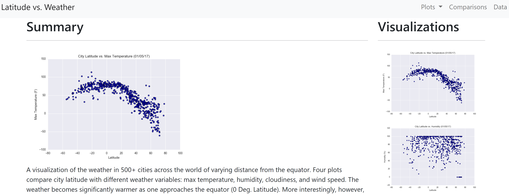
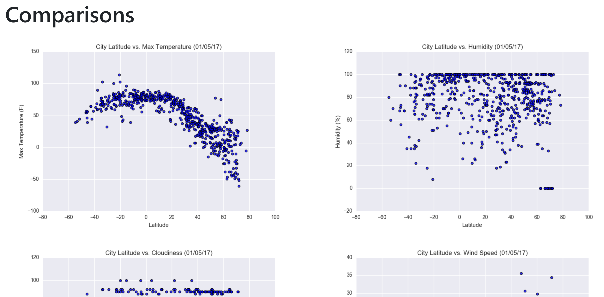
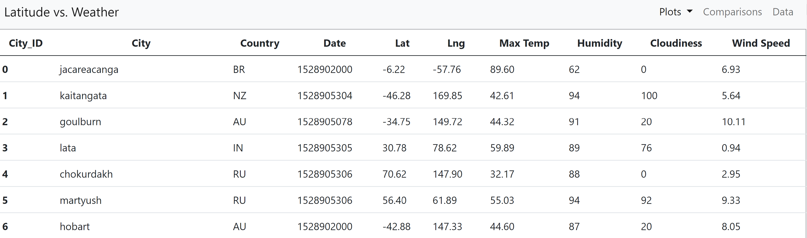

# Latitude Analysis Dashboard

[Visualization dashboard website](https://davewamu.github.io/Latitude-Analysis-Dashboard/) with charts analyzing weather data at different latitudes. The website includes individual pages for each plot. These pages contain the visualizations and their corresponding explanations. There is a comparison of all plots on the landing page, and the raw data table on the Data page.

## Latitude vs. Weather

## Steps

- A landing page containing:
  - An explanation of the project.
  - Links to each visualizations page. 
  - Sidebar containing preview images of each plot. Clicking an image takes the user to that visualization.
- Four visualization pages, each with:
  - The plot/visualization itself for the selected comparison.
  - A paragraph describing the plot and its significance.
- A "Comparisons" page that:
  - Contains all of the visualizations on the same page.
  - Uses a Bootstrap grid for the visualizations.
- A "Data" page that:
  - Displays a responsive table containing the data used in the visualizations.
- Includes a navigation menu bar and a plots list dropdown menu
- Deployed to GitHub pages [here]( https://davewamu.github.io/Latitude-Analysis-Dashboard/).

## Comparisons

## Data Source

- [OpenWeatherMap.org](https://openweathermap.org/) as a csv.

## Data Table

## Authors

- **David W. Mueller**
  - [LinkedIn Profile](https://www.linkedin.com/in/davidwaltermueller/)
  - davemuelle@gmail.com

## Acknowledgments

- Michigan State University Data Analytics Bootcamp; March 28, 2021.

## References

OpenWeatherMap.org. (2012). Сurrent weather and forecast. Retrieved from <https://openweathermap.org/>
